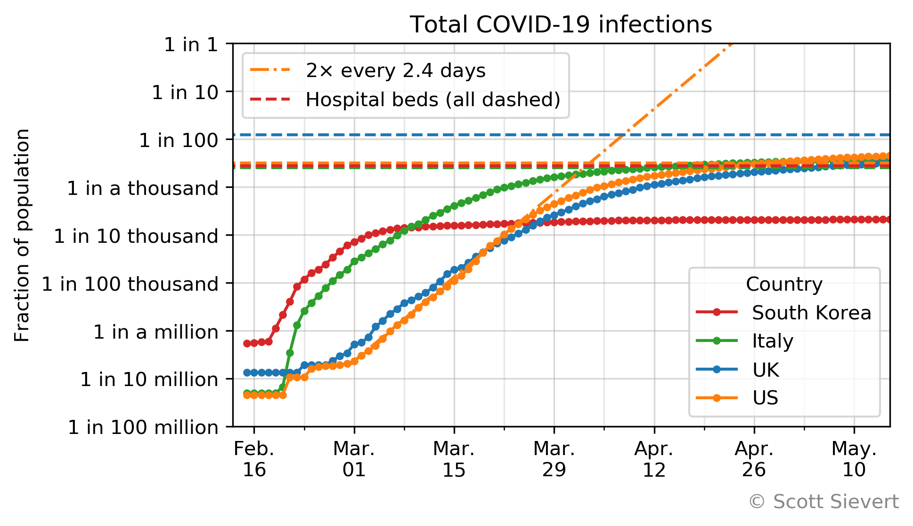
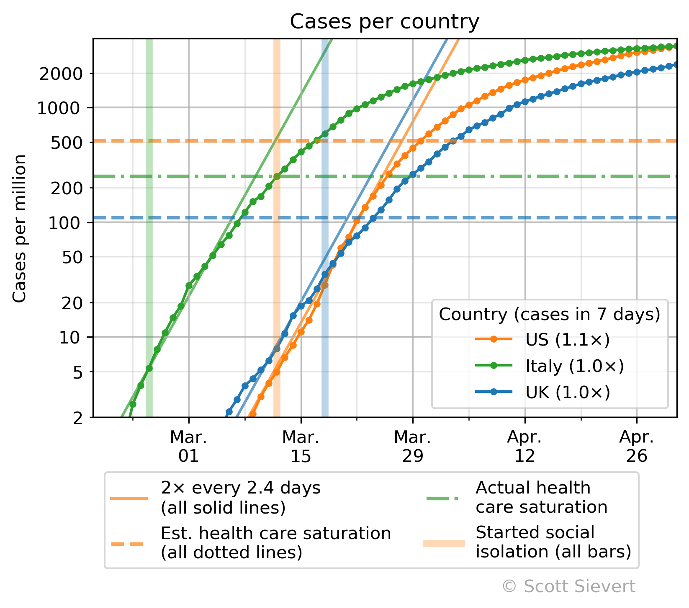
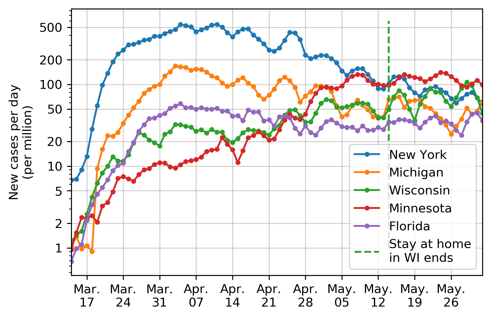
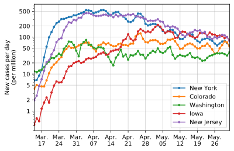
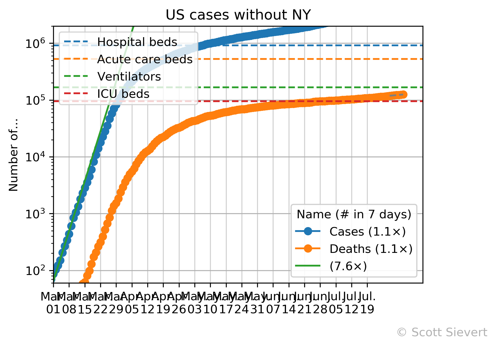
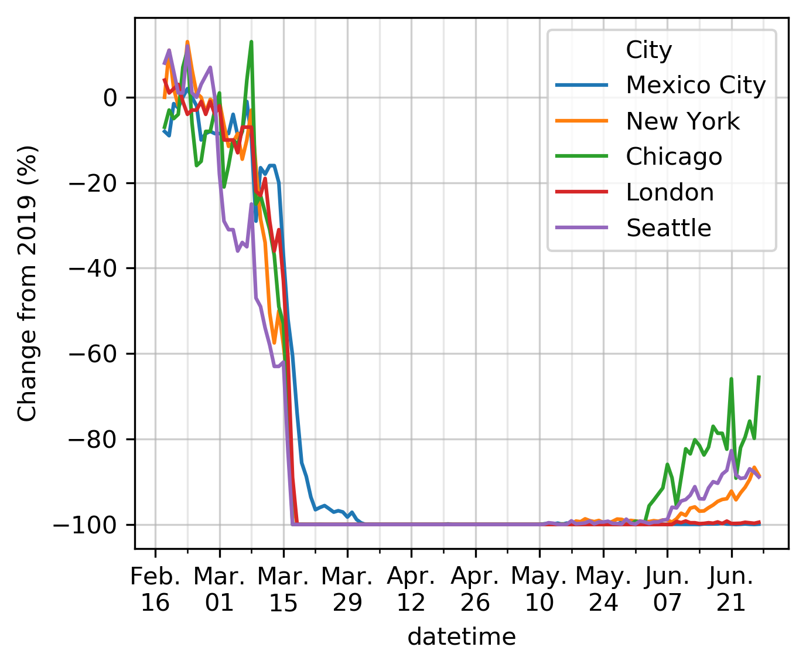
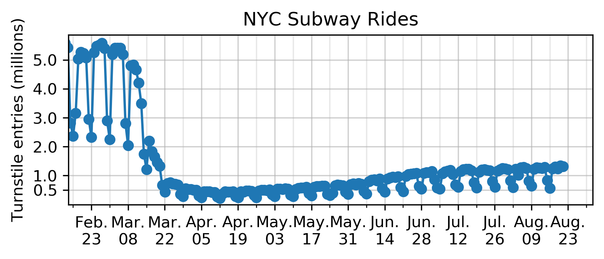

Infection rates in different countries:

Number of new cases in different countries:

Infection rates in select countries, with other metadata:

Infection rates in the US with more relevant metadata:

Infection rates in select US states:

Infection rates in the US without NY:

Restaurant reservations:

NYC subway rides:

